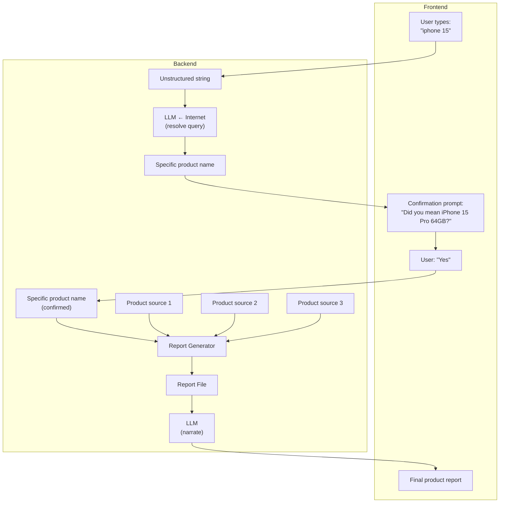

# Engineering handoff — product resolution & report generation

**For:** the engineer building the flow below.
**Status:** three of five stages exist and run today. Two don't exist yet. This doc says exactly which is which, and gives you the contracts to build the rest against.

---

## 1. The target flow



This is a straight recreation of the architecture diagram you were handed — same nodes, same order. Everything below maps directly onto it.

## 2. Status at a glance

| Diagram node | Status | Lives at |
|---|---|---|
| `Product source 1/2/3` | ✅ **Built and has run** | `src/prompts.js` → `productExtractionPrompt()`, called from `run.js` |
| `Report Generator` → `Report File` | ✅ **Built and has run** | `src/buildReports.js` |
| `LLM ← Internet` (query → specific product name) | 🟡 **Prompt written, not wired to search, not called from anywhere** | `src/prompts.js` → `productResolutionPrompt()` |
| `Confirmation prompt` → `"Yes"` | ⬜ **Not built** | No LLM call — pure frontend round-trip once resolution returns a name |
| `Report File` → `LLM` (narrate) → `Final product report` | 🟡 **Prompt written, not wired, not called from anywhere** | `src/prompts.js` → `reportNarrationPrompt()` |

Read that as: **the data layer exists, the orchestration around it doesn't.** Both missing pieces are Node scripts that call an existing prompt — not new prompt design.

## 3. Two things to understand before you write a line of code

**A single scoring engine is authoritative, and it lives outside this directory.** `../extension/scoring/pillars.js` computes every score, confidence level, and coverage state used anywhere in ClearCart — the browser extension, the server, and this pipeline all import the same file rather than each implementing scoring logic. `buildReports.js` already does this correctly (see §5) — `require('../../extension/scoring/pillars.js')` via `createRequire`, because this package is ESM (`"type": "module"` in `package.json`) and the engine is CommonJS. **Do not reimplement scoring anywhere in what you build.** If a report needs a score, it comes from calling into that file, full stop.

**Five rules the engine enforces, that any code you write must not quietly violate:**

1. **No composite score.** Never average, sum, or rank the five dimensions against each other. There is no "overall."
2. **Absence is not a zero.** A dimension with `coverage: "unknown"` has `score: null`. Rendering `null` as `0` or as a weak/red badge is the single most damaging mistake possible in this codebase — it turns "nobody will say" into "this product is bad," which is the opposite of what the product claims to do.
3. **A seller's own claim is `coverage: "claimed"`**, scores `null`, and is never treated as evidence.
4. **Confidence is reported, never applied.** It's a `high`/`medium`/`low` field next to the score, never multiplied into it.
5. **Evidence about the company isn't evidence about the product.** Any indicator with `sourceScope: "entity"` describes the seller, not necessarily the specific item — surface that distinction, don't collapse it.

These aren't style preferences — they're the project's entire differentiator, and they're checked in code: `scoring.assertNoComposite()` throws if called, and `scoring.validateAssessment(dimension)` returns a list of violations for anything that breaks rules 1–4. `buildReports.js` calls `validateAssessment` on every dimension it produces and fails loudly if anything comes back dirty — do the same in anything new you build that touches a `dimensions` object.

## 4. What already runs, and how to run it

```bash
cd clearcart-source-pipeline
npm install
cp .env.example .env        # then set a real ANTHROPIC_API_KEY — the checked-in one is currently dead (401)
```

| Command | Does what |
|---|---|
| `node run.js <source-slug>` | Fetches a reviewer's pages, runs `productExtractionPrompt`, writes `output/products/<slug>--<product>.json` |
| `node run.js` | Same, for every source in `data/sources.json` |
| `npm run reports` | Reads everything in `output/products/`, merges multi-source records per product, scores each through the real engine, writes `output/reports/<slug>.json` + `output/coverage-report.{json,md}` |
| `npm run preview` | Live dashboard at `localhost:5050` over whatever's in `output/` — re-reads on every request, no build step |

Six products, three sources, already extracted and scored — `output/reports/` has real data to build against right now. `INTAKE.md` in this directory covers adding more.

## 5. The five prompts — what each one is and its contract

All in `src/prompts.js`. Every one returns a prompt string; the caller sends it to `askClaudeJSON()` (`src/claude.js`) and gets parsed JSON back — that wrapper handles the Anthropic API call, model selection (`CLAUDE_MODEL` env var, defaults to `claude-sonnet-4-6`), and strips markdown fences from the response.

| Function | Line | Stage | Input | Output shape |
|---|---|---|---|---|
| `sourceProfilePrompt(name, pages)` | 6 | Profiles a reviewer site | fetched page text | methodology, trust tier, per-pillar coverage |
| `productExtractionPrompt(sourceName, page)` | 34 | **Product source 1/2/3** | one fetched review page | `{ product_name, brand, category, pillars: {...}, notable_signals }` — matches `output/products/*.json` |
| `productResolutionPrompt(userQuery, searchResults)` | 82 | **LLM ← Internet** | raw user string + search results text (you fetch these; this prompt doesn't) | `{ status: "resolved"\|"ambiguous"\|"not_found", resolved_name, confirmation_question, candidates[], reasoning }` |
| `pillarCustomizationPrompt(category, productRecords)` | 114 | (optional, not in this flow) | existing product records for a category | proposed category-specific scoring criteria |
| `reportNarrationPrompt(reportFile)` | 150 | **Report File → LLM** | one file from `output/reports/*.json`, whole | `{ product_name, summary, dimensions: { planet: {headline, explanation}, people: {...}, quality: {...}, value: {...}, transparency: {...} } }` |

### `productResolutionPrompt` — what you need to build around it

It does **not** search the internet. It takes `searchResults` as a plain string — you fetch that first, the same way `productExtractionPrompt` gets handed already-scraped page text rather than fetching pages itself. What fetches `searchResults` is your call:

- Reuse `src/fetchPage.js` against a search engine result page, or
- Call a search API (Tavily is referenced in project docs but isn't wired into any code in this repo yet — you'd be adding the first real integration), or
- Use Claude's native web-search tool at the API level, which sidesteps needing your own fetch step entirely

The prompt is written to **refuse to guess**: `status` comes back `"ambiguous"` with a `candidates` list, or `"not_found"`, rather than confidently inventing a SKU the search results don't support. Your orchestration needs to route `"ambiguous"` to the confirmation-prompt UI and `"not_found"` to some kind of "we couldn't find that" state — don't silently coerce either into a resolved name.

### `reportNarrationPrompt` — what you need to build around it

Give it the entire contents of one `output/reports/<slug>.json` file. It does not re-score anything — every `score`/`confidence`/`coverage` value it's given is final by the time it runs. Its rules (written into the prompt itself, not just documented here) specifically forbid:

- Combining dimensions into any kind of overall read
- Describing an `unknown` dimension as "low" or "weak" — the instruction is to name what's missing and, where the indicator data supports it, name the company that hasn't disclosed it
- Repeating a `claimed`-coverage finding as if it were independently established
- Letting `entity`-scope evidence read as if it were about the specific product

I ran this prompt's structure past the automated checks that matter (no composite language, no numeric score fabricated in prose, no downgrading Unknown into a weak-sounding label) — **but could not verify it against a live API call**, because the `ANTHROPIC_API_KEY` currently in `.env` is expired/invalid (401 on request). Get a working key and run it against `output/reports/naturepedic-eos-classic-mattress.json` before you build a UI on top of its output — that file has one `claimed`, one `inferred`, and one `scored` dimension in it, which is exactly the mix that exercises the prompt's rules.

## 6. The Report File shape — what `reportNarrationPrompt` (and your Stage 4 code) reads

Trimmed real output from `output/reports/naturepedic-eos-classic-mattress.json` — two dimensions shown, the other three (`quality`, `value`, `transparency`) follow the identical shape:

```json
{
  "product_name": "Naturepedic EOS Classic Mattress",
  "brand": "Naturepedic",
  "category": "mattresses",
  "slug": "naturepedic-eos-classic-mattress",
  "dimensions": {
    "planet": {
      "dimension": "planet",
      "label": "Planet",
      "rightsBearing": true,
      "score": 3,
      "confidence": "medium",
      "coverage": "inferred",
      "passes": true,
      "indicators": [
        {
          "label": "Uses GOLS-certified organic latex and GOTS-certified organic cotton/wool...",
          "anchor": 3,
          "met": true,
          "sourceTier": 3,
          "sourceScope": "good",
          "source": "Clarity Insight Advisory (Buy Better With Brian)",
          "sourceUrl": "https://clarityinsightadvisory.com/gear/"
        }
      ],
      "note": "Acceptable"
    },
    "people": {
      "dimension": "people",
      "label": "People & Supply Chain",
      "rightsBearing": true,
      "score": null,
      "confidence": null,
      "coverage": "claimed",
      "passes": false,
      "indicators": [
        {
          "label": "Handcrafted by Amish artisans in a Ohio factory...",
          "anchor": 3,
          "met": true,
          "sourceTier": 5,
          "sourceScope": "good",
          "source": "Clarity Insight Advisory (Buy Better With Brian)",
          "sourceUrl": "https://clarityinsightadvisory.com/gear/"
        }
      ],
      "note": "Only the seller's own material addresses this. Asks the enterprise to substantiate."
    }
  },
  "screen": {
    "qualifies": false,
    "failedOnEvidence": ["people"],
    "failedOnPerformance": [],
    "reason": "Fails on evidence, not on performance. Nothing establishes how this good performs on People & Supply Chain."
  },
  "sources": [
    { "slug": "clarity-insight", "reviewer": "Clarity Insight Advisory (Buy Better With Brian)", "trust_tier": "medium", "url": "https://clarityinsightadvisory.com/gear/" }
  ],
  "ranking": { "populatedDimensions": 4, "rightsBearingPopulated": 1, "totalClaims": 8, "sourceCount": 1, "sources": ["clarity-insight"] },
  "generated_at": "2026-09-15T20:52:23.026Z",
  "generator_note": "Scores use a placeholder single-anchor scheme..."
}
```

Notice `score: null` on `people` — not `0`, not a missing key. That `null` has to survive intact through every layer between here and whatever the frontend renders. If a score turns into `0` anywhere in your code (a default parameter, a `|| 0`, a database column that can't hold `NULL`), you've silently broken rule 2 in §3.

`screen` is the conjunctive pass/fail: a product only "qualifies" if every dimension clears the threshold, and — per `generator_note` — expect `qualifies: false` on almost everything right now. That's the correct, honest result on current evidence, not a bug to chase away.

## 7. What's actually left to build

In the order this flow needs them:

1. **A search/grounding step in front of `productResolutionPrompt`.** Nothing fetches `searchResults` yet. Decide: scrape a search engine via `fetchPage.js`, call a search API, or use Claude's native web-search tool.
2. **A Stage 0 script** (new file, e.g. `src/resolveProduct.js`) that takes a raw user string, gets search results, calls `productResolutionPrompt`, and returns the shape the frontend confirmation UI needs.
3. **A lookup step from confirmed product name → matching `output/reports/<slug>.json`.** Not built. Simplest version: normalize the confirmed name the same way `buildReports.js`'s `slugify()` does and check for a matching file; fall back to "we don't have a report for that yet" when it misses.
4. **A Stage 4 script** (e.g. `src/generateReport.js`) that reads that report file and calls `reportNarrationPrompt`.
5. **Fix the dead API key** in `.env` — blocks testing all of the above.

## 8. Two open modeling questions, not yet resolved — ask before you build UI around them

- **Placeholder anchor scheme.** Every claim in a Report File gates at anchor 3 (pass) or 0 (adverse) — there's no per-category rubric yet defining what a 4 or 5 requires (`BACKLOG.md`, item **D1**). Scores are real and correctly computed, just coarse. If your UI shows a 0–5 scale expecting fine-grained distinctions, it'll be showing precision the data doesn't have.
- **Tier-3-about-the-good-itself currently reads as `Inferred`.** A citation-tier source (`cited_third_party`) describing the specific product — not the company, not the category — still gets bucketed as `Inferred` rather than `Scored`, because the engine's `Scored` threshold requires tier 1–2. That's arguably a simplification worth revisiting, flagged in `INTAKE.md`, not yet a settled decision.

## 9. Where the rest of the context lives

- `../CAPSTONE.md` — the research this whole framework implements; §3.1 and §3.5 explain *why* the five rules in §3 above exist
- `../BACKLOG.md` — the fuller team backlog this flow's remaining pieces (items A1, A6, C1–C4) sit inside
- `INTAKE.md` (this directory) — how to add more source data and read the coverage leaderboard
- `../extension/scoring/pillars.js` — the scoring engine itself, heavily commented
